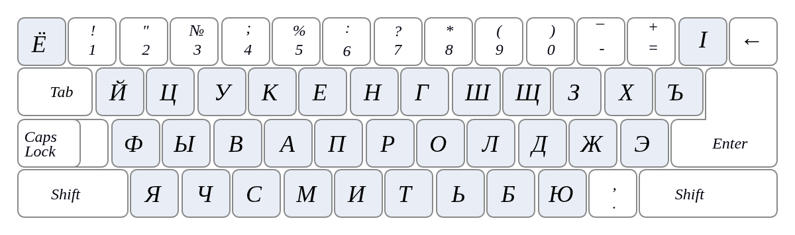

# Техническое обоснование выбора клавиши

## Стабильность позиции:
Клавиша | (Backslash) имеет фиксированное положение в правой верхней части большинства клавиатур (ANSI и ISO стандарты). Это позволяет пользователю выработать мышечную память, которая не зависит от смены раскладки.

Визуальное сходство:
Символ | (вертикальная черта) визуально идентичен чеченской «палочке» (Ӏ). Это делает переход для пользователя интуитивно понятным: «нажимай на то, что выглядит как палочка».

Сохранение стандартов:
Вы не меняете расположение букв в стандартной русской или английской раскладке. Это критично для профессиональных машинисток и людей, привыкших к слепому набору.

Программная подмена (Mapping):
При нажатии этой клавиши ваш драйвер или скрипт должен выдавать именно U+04C1 (заглавная) или U+04C2 (строчная), а не просто символ вертикальной черты. Это обеспечит корректную работу поиска и проверку орфографии.

## Эргономика и раскладка:
Логика ввода специфических символов:
Для обеспечения максимальной доступности и удобства пользователя, ввод чеченской «палочки» (U+04C1/U+04C2) закреплен за физической клавишей [ \ | ] в правой верхней части клавиатуры.

## Преимущества данного решения:
Универсальность:
Клавиша сохраняет свою функцию ввода чеченского спецсимвола вне зависимости от активного языкового режима (RU/EN).

Совместимость:
Стандартные буквенные блоки QWERTY и ЙЦУКЕН остаются нетронутыми.

Интуитивность:
Визуальное соответствие гравировки клавиши | и чеченской буквы Ӏ облегчает обучение новых пользователей.
